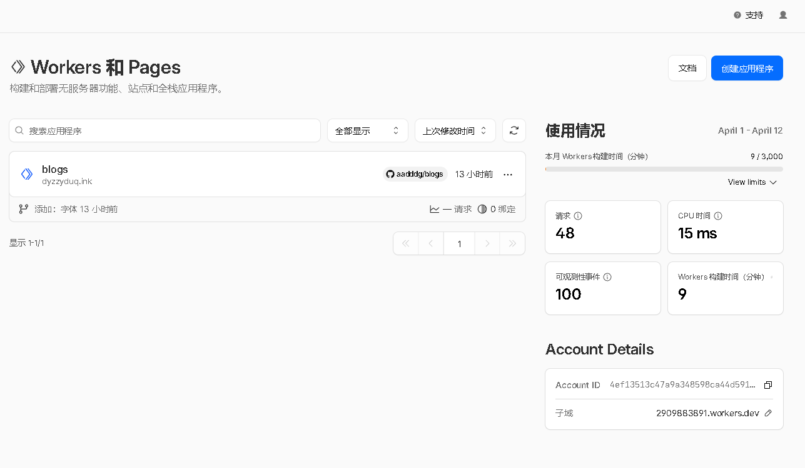
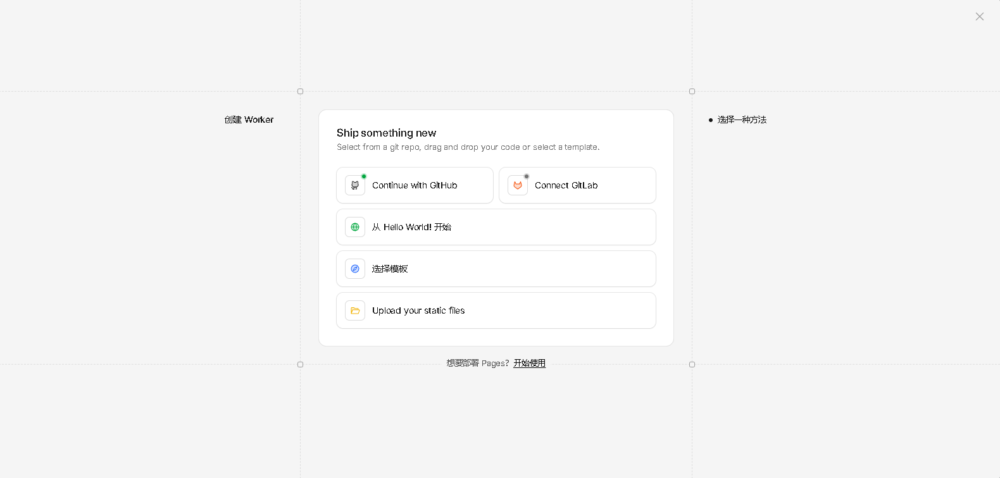
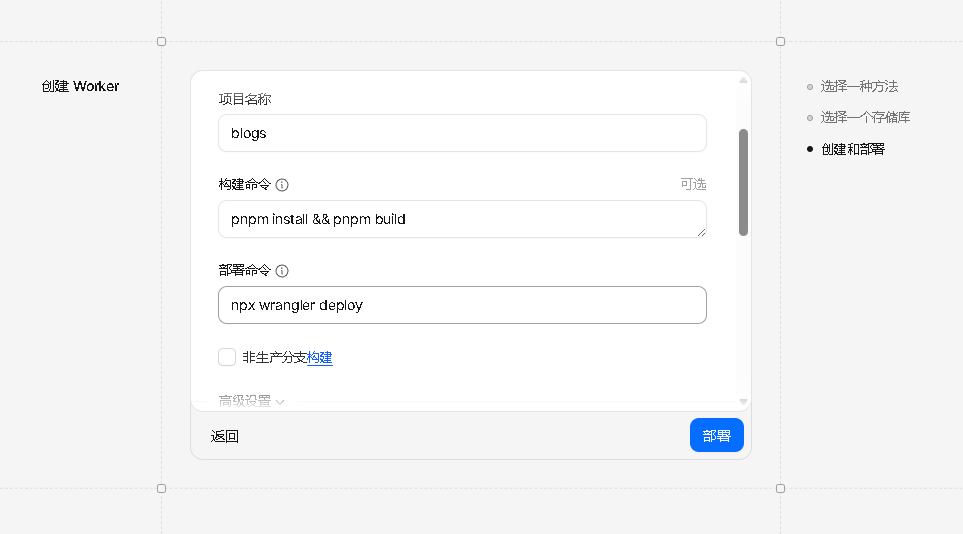

## 1 前言

本博客使用模板构建，项目地址:[aadddg/blogs](https://github.com/aadddg/blogs)
最近国内的服务器被创了喵，突发奇想把备案撤了，转手使用CF-Workers

### 为什么选择 Workers？

- **全球 CDN 加速**：利用 Cloudflare 全球网络，实现快速内容分发
- **免费额度充足**：免费处理静态网页！
- **无需服务器**：Serverless 架构，省去维护服务器的麻烦
- **优选方便**：仅需几步即可完成优选，加速访问!
## 2 部署过程

### 2.1 准备工作

在开始之前，你需要准备以下内容：

1. 一个已构建完成的静态博客项目
2. 一个 Cloudflare 账号
3. 一个域名

### 2.2 配置 Worker 

添加 `wrangler.jsonc` 文件，配置 Worker 项目：

```jsonc
{
	"name": "和你的名称保持一致",
	"compatibility_date": "2026-04-06",
	"workers_dev": false,
	"preview_urls": false,
	"assets": {
		"directory": "./dist",
		"not_found_handling": "404-page"
	}
}
```

### 2.3 创建 Worker 项目

首先，我们需要创建一个 Workers 项目来托管静态文件。

本文偏小白向，所以使用CF官网操作
1. 登录 Cloudflare 账号
2. 进入 Workers & Pages

3. 点击 Create Worker/创建应用程序

4. 点击 Continue with GitHub/继续使用 GitHub 登录
5. 选择你的 GitHub 项目，例如 `aadddg/blogs`，下一步
6. 输入 构建命令和部署命令
```bash
# 构建命令
pnpm install && pnpm build
# 部署命令
npx wrangler deploy
```



## 3 优选过程

详见[2x.nz](https://2x.nz/posts/cf-fastip)。

## 总结

通过本文的介绍，你应该已经掌握了：

1. ✅ 使用 Cloudflare Workers 部署静态博客的基本流程
2. ✅ 应用优选提升访问速度

**注意事项：**

- 优选 IP 可能会失效，需要定期更新
- 国内访问 Cloudflare 可能仍存在一定延迟，可根据实际情况考虑是否使用其他方案

---

*希望这篇文章对你有所帮助！如有问题欢迎交流讨论。*
